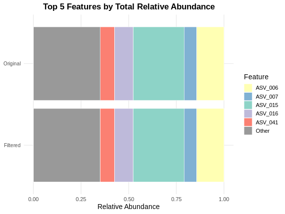

# Introduction

The `featuretablefilter` package provides functions for filtering microbiome feature tables based on coverage and abundance criteria. It is designed to help researchers remove low-quality samples and rare features from their datasets while maintaining comprehensive quality control metrics.

## Key Features

- **Sample Coverage Filtering**: Remove samples with insufficient sequencing depth
- **Feature Abundance Filtering**: Filter out rare features based on absolute or relative thresholds
- **Data-driven Cutoff Estimation**: MAD-based and IQR-based threshold estimation
- **Quality Control Metrics**: Comprehensive metrics including sparsity, retention rates, and rank-abundance stability
- **Visualization**: Multiple plotting functions for exploring filtering effects

# Installation and Loading


``` r
library(featuretablefilter)
```

# Loading Data

The package includes a function to load feature tables in common formats. We also ship an example feature table for illustration.


``` r
# Load example data shipped with the package
data(example_feature_table)
head(example_feature_table[, 1:4])
#>   #OTU ID Sample_001 Sample_002 Sample_003
#> 1 ASV_001       1245        892       1567
#> 2 ASV_002        567        423        689
#> 3 ASV_003        234        178        289
#> 4 ASV_004         89         67        112
#> 5 ASV_005       3456       2789       4123
#> 6 ASV_006      12345      10234      14567
dim(example_feature_table)
#> [1] 50 21

# Load from a TSV file
file_path <- system.file("extdata", "example_feature_table.tsv",
                         package = "featuretablefilter")
table <- load_feature_table(file_path)
head(table[, 1:4])
#>   #OTU ID Sample_001 Sample_002 Sample_003
#> 1 ASV_001       1245        892       1567
#> 2 ASV_002        567        423        689
#> 3 ASV_003        234        178        289
#> 4 ASV_004         89         67        112
#> 5 ASV_005       3456       2789       4123
#> 6 ASV_006      12345      10234      14567
```

## Feature Table Format

The expected format is a tab-separated or comma-separated file where:

- The first column contains feature IDs (e.g., OTU IDs, ASV IDs, taxon names)
- Remaining columns contain sample counts with sample names as column headers
- Values are integer counts of reads/features per sample

# Sample Coverage Filtering

## Absolute Threshold Filtering

Remove samples with total read count below a fixed threshold:


``` r
data(example_feature_table)
filtered_table <- filter_by_coverage(example_feature_table, min_reads = 1000)
ncol(filtered_table)
#> [1] 21
```

## Data-driven Threshold Estimation

### MAD-based Method

The Median Absolute Deviation (MAD) method identifies outliers using the formula:
$$\\text{cutoff} = \\max(\\text{floor}, \\text{median} - \\text{multiplier} \\times \\text{MAD})$$


``` r
data(example_feature_table)
est <- estimate_mad_cutoff(example_feature_table, multiplier = 3, floor = 0)
est$cutoff
#> [1] 31530.63

filtered_table <- filter_by_coverage(example_feature_table, min_reads = est$cutoff)
ncol(filtered_table)
#> [1] 21
```

### IQR-based Method

The Interquartile Range (IQR) method uses Tukey's fences:
$$\\text{cutoff} = \\max(\\text{floor}, Q1 - \\text{multiplier} \\times \\text{IQR})$$


``` r
est <- estimate_iqr_cutoff(example_feature_table, multiplier = 1.5, floor = 0)
est$cutoff
#> [1] 34525.38

filtered_table <- filter_by_coverage(example_feature_table, min_reads = est$cutoff)
ncol(filtered_table)
#> [1] 21
```

## Ecological Completeness-Based Filtering

Instead of using absolute sequencing depth cutoffs, you can filter samples based on estimated ecological completeness using coverage estimators. These methods assess whether a sample has been sequenced deeply enough to capture the diversity present.

### Good's Coverage

Good's coverage estimator measures the probability that the next read will belong to a previously observed feature:

$$C = 1 - \\frac{n_1}{n}$$

where $n_1$ is the number of singletons (features with exactly one read) and $n$ is the total number of reads.


``` r
good_cov <- estimate_good_coverage(example_feature_table, target_coverage = 0.95)
good_cov$mean_coverage
#> [1] 0.9999796

result <- filter_by_coverage_estimator(
  example_feature_table,
  method = "good",
  target_coverage = 0.95,
  verbose = FALSE
)
#> Error in `filter_by_coverage_estimator()`:
#> ! unused argument (verbose = FALSE)
ncol(result$table)
#> Error:
#> ! object 'result' not found
```

### Chao's Coverage

Chao's coverage estimator is more conservative and accounts for unseen species/features using both singletons and doubletons:


``` r
chao_cov <- estimate_chao_coverage(example_feature_table, target_coverage = 0.90)
chao_cov$mean_coverage
#> [1] 0.96552

result <- filter_by_coverage_estimator(
  example_feature_table,
  method = "chao",
  target_coverage = 0.90,
  verbose = FALSE
)
#> Error in `filter_by_coverage_estimator()`:
#> ! unused argument (verbose = FALSE)
ncol(result$table)
#> Error:
#> ! object 'result' not found
```

# Feature Abundance Filtering

## Absolute Count Filtering

Remove features with low total read counts:


``` r
filtered_table <- filter_features_by_abundance(
  example_feature_table,
  threshold = 5,
  mode = "absolute",
  min_samples = 1
)
nrow(filtered_table)
#> [1] 43
```

## Relative Abundance Filtering

Filter features based on proportion of total reads:


``` r
filtered_table <- filter_features_by_abundance(
  example_feature_table,
  threshold = 0.001,
  mode = "relative",
  min_samples = 1
)
nrow(filtered_table)
#> [1] 31
```

## Joint Abundance-Prevalence Filtering

A powerful filtering approach that combines abundance thresholds with prevalence requirements using AND/OR logic.


``` r
result <- filter_features_joint(
  example_feature_table,
  abundance_threshold = 0.001,
  prevalence_threshold = 0.3,
  mode = "relative",
  logic = "OR"
)
result$n_features_after
#> [1] 31
```

## Relative Cutoff Method

This method calculates an absolute threshold based on a percentage of the minimum-coverage sample:


``` r
filtered_table <- filter_by_relative_cutoff(
  example_feature_table,
  min_coverage = 1000,
  relative_threshold = 0.01,
  remove_features = TRUE
)
nrow(filtered_table)
#> NULL
```

# Complete Filtering Pipeline

The `run_filtering_pipeline()` function orchestrates a complete workflow:


``` r
data(example_feature_table)
result <- run_filtering_pipeline(
  input = example_feature_table,
  output_dir = tempdir(),
  prefix = "analysis1",
  cov_filter_method = "mad",
  cov_threshold = 3,
  abun_filter_method = "absolute",
  abun_threshold = 10,
  generate_report = FALSE,
  verbose = FALSE
)
#> Evaluating 20 threshold values...
#>   Completed 4/20 (threshold = 1.6316)
#>   Completed 8/20 (threshold = 2.4737)
#>   Completed 12/20 (threshold = 3.3158)
#>   Completed 16/20 (threshold = 4.1579)
#>   Completed 20/20 (threshold = 5.0000)
#> 
#> Scree analysis complete.
#>   Elbow point: threshold = 1.2105, retention = 100.0%
#>   Final retention: 100.0% at threshold = 5.0000
#> Warning: Removed 4 rows containing missing values or values outside the scale range
#> (`geom_line()`).
#> Warning: Removed 1 row containing missing values or values outside the scale range
#> (`geom_hline()`).
#> Warning: Removed 1 row containing missing values or values outside the scale range
#> (`geom_line()`).

nrow(result$filtered_table)
#> [1] 50
ncol(result$filtered_table)
#> [1] 21
```

# Quality Control Metrics

Compute comprehensive QC metrics comparing original and filtered tables:


``` r
qc <- compute_filtering_qc(example_feature_table, result$filtered_table, top_n = 10)
qc$feature_retention_percent
#> [1] 100
qc$sample_retention_percent
#> [1] 100
```

# Visualization

## Coverage Distribution


``` r
plot_coverage_histogram(example_feature_table)
```

## QC Comparison Plots


``` r
plots <- plot_qc_comparison(example_feature_table, result$filtered_table)
names(plots)
#> [1] "plots"
```

## Top Features Stacked Barplot


``` r
plot_top_features_stacked(example_feature_table, result$filtered_table, top_n = 5)
#> $plot_path
#> NULL
#> 
#> $orig_top_features
#> [1] "ASV_015" "ASV_006" "ASV_016" "ASV_041" "ASV_007"
#> 
#> $filt_top_features
#> [1] "ASV_015" "ASV_006" "ASV_016" "ASV_041" "ASV_007"
#> 
#> $orig_rels
#>    ASV_015    ASV_006    ASV_016    ASV_041    ASV_007      Other 
#> 0.26798082 0.14342487 0.09794964 0.07482170 0.06520458 0.35061840 
#> 
#> $filt_rels
#>    ASV_015    ASV_006    ASV_016    ASV_041    ASV_007      Other 
#> 0.26805685 0.14346556 0.09797743 0.07484293 0.06522308 0.35043416 
#> 
#> $plot
```



# Session Info


``` r
sessionInfo()
#> R version 4.3.1 (2023-06-16)
#> Platform: x86_64-conda-linux-gnu (64-bit)
#> Running under: Ubuntu 24.04.4 LTS
#> 
#> Matrix products: default
#> BLAS/LAPACK: /home/vojtechbarton/anaconda3/lib/libopenblasp-r0.3.30.so;  LAPACK version 3.12.0
#> 
#> locale:
#>  [1] LC_CTYPE=en_US.UTF-8       LC_NUMERIC=C              
#>  [3] LC_TIME=cs_CZ.UTF-8        LC_COLLATE=en_US.UTF-8    
#>  [5] LC_MONETARY=cs_CZ.UTF-8    LC_MESSAGES=en_US.UTF-8   
#>  [7] LC_PAPER=cs_CZ.UTF-8       LC_NAME=C                 
#>  [9] LC_ADDRESS=C               LC_TELEPHONE=C            
#> [11] LC_MEASUREMENT=cs_CZ.UTF-8 LC_IDENTIFICATION=C       
#> 
#> time zone: Europe/Prague
#> tzcode source: system (glibc)
#> 
#> attached base packages:
#> [1] stats     graphics  grDevices utils     datasets  methods   base     
#> 
#> other attached packages:
#> [1] featuretablefilter_1.0.0 knitr_1.51              
#> 
#> loaded via a namespace (and not attached):
#>  [1] Matrix_1.6-5        gtable_0.3.6        vegan_2.7-5        
#>  [4] dplyr_1.2.1         compiler_4.3.1      tidyselect_1.2.1   
#>  [7] parallel_4.3.1      tidyr_1.3.2         cluster_2.1.8.2    
#> [10] splines_4.3.1       scales_1.4.0        yaml_2.3.12        
#> [13] lattice_0.22-9      ggplot2_4.0.3       R6_2.6.1           
#> [16] labeling_0.4.3      patchwork_1.3.2     generics_0.1.4     
#> [19] BiocGenerics_0.48.1 MASS_7.3-60.0.1     tibble_3.3.1       
#> [22] pillar_1.11.1       RColorBrewer_1.1-3  rlang_1.3.0        
#> [25] xfun_0.60           S7_0.2.2            otel_0.2.0         
#> [28] cli_3.6.6           withr_3.0.3         magrittr_2.0.5     
#> [31] mgcv_1.9-3          grid_4.3.1          permute_0.9-10     
#> [34] nlme_3.1-170        lifecycle_1.0.5     S4Vectors_0.40.2   
#> [37] vctrs_0.7.3         pheatmap_1.0.13     evaluate_1.0.5     
#> [40] glue_1.8.1          farver_2.1.2        zoo_1.8-15         
#> [43] stats4_4.3.1        purrr_1.2.2         tools_4.3.1        
#> [46] pkgconfig_2.0.3
```

# References

For more information, visit the package repository or see the README.md file.
